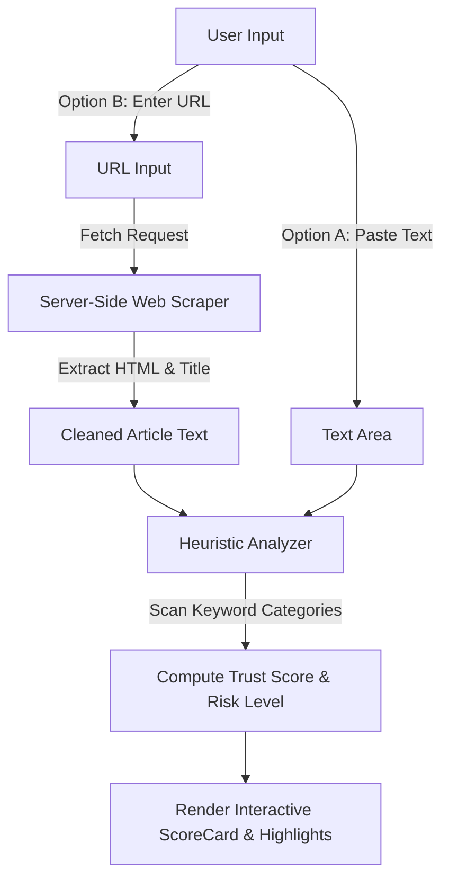
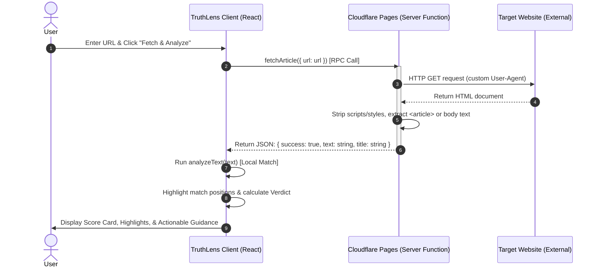

# 🔍 TruthLens — Misinformation & Fake News Detector

TruthLens is a full-stack, lightweight heuristic scanner that helps users evaluate the trustworthiness of news articles, headlines, or social media posts before sharing them. By scanning content for red-flag keyword categories (such as sensationalism, clickbait, false urgency, emotional manipulation, unverified sourcing, and conspiracy patterns), TruthLens outputs an instant **Trust Score** from 0 to 100 with actionable feedback.

---

## 🚀 Key Features

- **Heuristic Phrase Scanner**: Evaluates the presence of over 80+ clickbait and manipulative keywords across 6 categories.
- **Web Scraper**: Extracts main body text from any valid article URL server-side.
- **Actionable Visual Breakdown**: Interactive pie chart / bar visualization of detected category scores, and color-coded highlight view of the original text.
- **Trust Verdict & Risk Levels**: Displays intuitive risk statuses (🔴 High, 🟡 Medium, 🟢 Low) and clear next-step guidelines.
- **Modern Responsive Dark-Mode UI**: Crafted with responsive design using Space Grotesk typography, subtle glassmorphic textures, and elegant gradients.
- **Zero-Dependency Core**: Evaluates text client-side via optimized regular expressions.

---

## 🛠️ Tech Stack

| Layer                  | Technology                           | Rationale                                                                                                                         |
| :--------------------- | :----------------------------------- | :-------------------------------------------------------------------------------------------------------------------------------- |
| **Frontend Framework** | **React 19 & TanStack Start**        | Modern isomorphic full-stack rendering framework. Provides server function RPCs out-of-the-box and lightning-fast loading speeds. |
| **Styling**            | **Tailwind CSS v4 & tw-animate-css** | Utilizes Tailwind's new native build system for maximum performance, clean CSS, custom variables, and sleek micro-animations.     |
| **Server Engine**      | **Cloudflare Pages / wrangler**      | Edge-runtime ready deployment that scales infinitely and handles HTML fetching via a serverless worker environment.               |
| **Validation**         | **Zod**                              | Schema validation for URL input ensuring secure endpoints.                                                                        |

---

## 📂 Code Structure & Folder Organization

```bash
truth-spark-main/
├── src/
│   ├── components/            # Shared UI elements
│   │   └── ui/
│   │       └── button.tsx     # Custom styled Button component
│   ├── lib/                   # Business logic and helpers
│   │   ├── analyzer.ts        # Misinformation analysis logic and text highlighter
│   │   └── utils.ts           # Classnames merging utility
│   ├── routes/                # TanStack file-based routing
│   │   ├── __root.tsx         # Layout, metadata, and HTML wrapper
│   │   └── index.tsx          # Main TruthLens Scanner page and components
│   ├── server/                # Server-only functions
│   │   └── article.functions.ts  # Web fetch and HTML parser
│   ├── router.tsx             # TanStack Router configuration
│   ├── routeTree.gen.ts       # Autogenerated file routes
│   └── styles.css             # Main styling, design tokens, and theme settings
├── components.json            # Component library configuration
├── eslint.config.js           # Linting setup
├── package.json               # Dependencies and execution scripts
├── tsconfig.json              # TypeScript compilation rules
├── vite.config.ts             # Standard Vite + TanStack Start builder config
└── wrangler.jsonc             # Cloudflare Pages deployment settings
```

---

## 🔄 Workflow Explanation

TruthLens processes news articles in two ways: **Direct Text Paste** or **URL Ingestion**.

### 1. High-Level Ingestion Pipeline



### 2. Execution Flow Diagram (Server & Client Interaction)



---

## ⚡ Setup & Installation

### Prerequisites

- **Node.js**: `v18.x` or higher
- **npm**: `v9.x` or higher

### Installation

1. Clone or extract the project folder:

   ```bash
   cd truth-spark-main
   ```

2. Install only the required dependencies (production-ready and pruned):
   ```bash
   npm install
   ```

---

## 💻 Local Execution Instructions

### Run the Development Server

Start the local server with hot-reload enabled:

```bash
npm run dev
```

The application will be accessible at: [http://localhost:8080](http://localhost:8080)

### Production Build

Compile client assets and server bundle for Cloudflare deployment:

```bash
npm run build
```

### Preview Production Build

Preview the compiled site locally:

```bash
npm run preview
```

---

## 📖 Usage Instructions

1.  **Paste Text Mode**:
    - Open [http://localhost:8080](http://localhost:8080).
    - Paste any suspicious paragraph or social media claim into the text box.
    - Click **Analyze**.
2.  **Fetch URL Mode**:
    - Paste an article URL into the top input box (e.g. `https://example.com/breaking-news-exposed`).
    - Click **Fetch & Analyze**.
    - The app will retrieve the content, auto-fill the text box, and run the scan.
3.  **Understanding the Results**:
    - **Trust Score (0-100)**: Higher is better. A score below 30 indicates **Highly Suspicious** content.
    - **Detected Signals**: Click on specific tags to see which exact phrases triggered flags.
    - **Highlighted Text**: Visual representation showing exactly where loaded words were used in context.
    - **What to do next**: Actionable advice on how to cross-check the claims.
