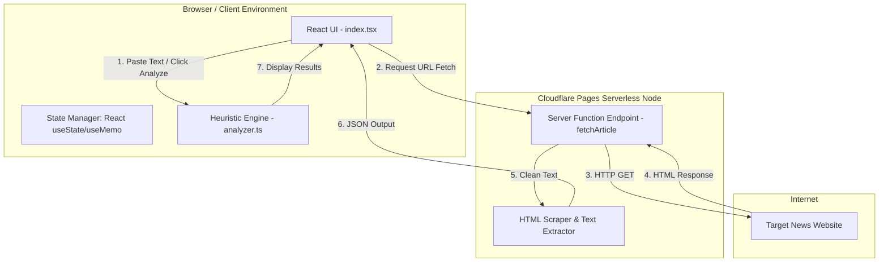
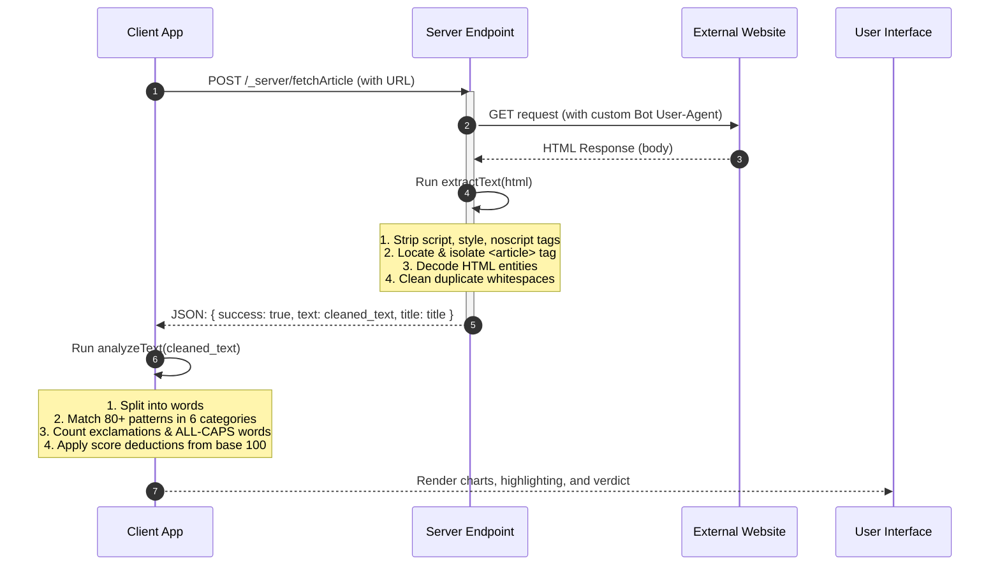

# 🏗️ System Architecture Design — TruthLens

This document outlines the detailed system architecture, component integrations, and technical design patterns behind **TruthLens**.

---

## 1. Project Objective & Core Concept

Misinformation thrives on urgency, extreme emotional cues, clickbait hooks, and unverified source claims. The objective of **TruthLens** is to provide an instant, user-friendly **first-pass heuristic assessment** of news credibility. 

TruthLens does not verify facts (which requires web searches or deep AI reasoning), but instead analyzes the *writing style and linguistic tactics* commonly used by malicious actors to capture attention and manipulate readers.

---

## 2. System Architecture Overview

TruthLens is built using **TanStack Start**, a full-stack, React-native meta-framework. It leverages server-side edge runtimes (Cloudflare Pages/Workers) to scrape article content, and client-side processing to evaluate heuristics instantly without causing latency or backend load.

### System Components Diagram

---

## 3. Data Flow & Execution Sequence

When a user submits a URL, the system performs a transition from client to server and back to client.

---

## 4. Key Modules & Responsibilities

### 1. Main Page Controller (`src/routes/index.tsx`)
*   Manages UI state (fetch states, error handling, result display).
*   Handles URL submission forms and pasted text areas.
*   Triggers the highlight parsing engine on successful evaluation.

### 2. Heuristic Analyzer Engine (`src/lib/analyzer.ts`)
*   **`analyzeText(text)`**: Receives plain text, counts words, run regular expression scans for defined keywords, computes punctuation rates, applies deduction logic, and returns an `AnalysisResult` object.
*   **`highlightText(text, matches)`**: Tokens the original text and wraps matched keywords in styled tags for dynamic inline highlighting.

### 3. Server Web Fetcher (`src/server/article.functions.ts`)
*   Acts as an server-side proxy avoiding CORS blockages.
*   Runs clean extraction using regular expressions (without heavy library dependencies like JSDOM or Cheerio, making it extremely lightweight and compatible with Cloudflare edge workerd runtime).

---

## 5. Technology Choices & Design Rationale

1.  **TanStack Start**: Chosen for its seamless integration of React, File-based Routing, and Server Functions. It eliminates the need for separate frontend and backend deployments.
2.  **Tailwind CSS v4**: Features a CSS-first build pipeline, dropping javascript compile steps, resulting in faster development build times.
3.  **Cloudflare Pages Integration**: The server portion is designed to be fully compatible with the serverless environment (`nodejs_compat` configuration in `wrangler.jsonc`), keeping cold starts close to zero milliseconds.
4.  **No-Library Scraper**: Instead of utilizing large HTML parsers, we created regex-based selectors. This drastically reduces the server bundle size and avoids memory leaks.

---

## 6. Heuristic Scoring Algorithm

The `analyzeText` function starts at a baseline **Trust Score of 100** and applies deductions:

$$\text{Trust Score} = 100 - (\text{Category Deductions}) - (\text{Punctuation Deductions}) - (\text{ALL CAPS Deductions}) - (\text{Conspiracy Penalties})$$

### Deduction Matrix

| Signal Trigger | Rule | Maximum Deduction |
| :--- | :--- | :--- |
| **Suspicious Keywords** | $-5$ points per match | $-50$ points |
| **Exclamation Marks** | $-2$ points per `!` | $-15$ points |
| **Repeated Punctuation** | $-5$ points per occurrences (e.g. `!!!`, `??`) | $-10$ points |
| **ALL CAPS words** | $-3$ points per word (length $\ge 4$) | $-15$ points |
| **Conspiracy Language** | Extra $-4$ points per match | $-20$ points |

The final score is clamped between $0$ and $100$.
*   **🟢 Low Risk (Score 80–100)**: Likely normal reporting style.
*   **🟡 Medium Risk (Score 55–79)**: Minor sensationalist/emotional language detected.
*   **🔴 High Risk (Score 0–54)**: Heavy conspiracy tags, clickbait hooks, or exaggerated punctuation.
