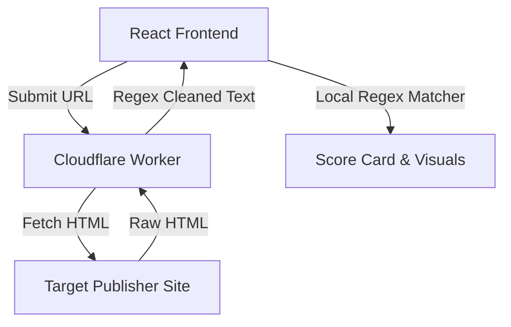

# 📖 Complete Project Documentation — TruthLens

This document serves as the absolute reference manual for **TruthLens**, compiling product goals, algorithm specifications, software engineering design, benefits, trade-offs, and verification workflows.

---

## 1. Executive Summary & Objective

In the digital age, information spreads faster than it can be verified. High-quality fact-checking takes hours or days. Meanwhile, sensational clickbait and manipulative articles go viral.

**TruthLens** addresses this by providing **instant linguistic analysis**. It scans articles for formatting issues, emotional manipulation, false urgency, and conspiracy phrasing, empowering users to make immediate, informed sharing decisions.

---

## 2. Problem-Solving Approach

Rather than relying on resource-intensive, slow AI models or centralized fact-checker databases, TruthLens uses a **rule-based heuristic approach**:

1.  **Direct Ingestion**: Users can paste text directly or input a URL.
2.  **Serverless Scraping**: The server fetches the website, extracts the readable text, and returns it to the client, bypassing CORS issues.
3.  **Linguistic Classification**: Scans the text for patterns indicating low-quality or manipulative reporting.
4.  **Score Calculation**: Calculates a numerical Trust Score based on stylistic and formatting deductions.

---

## 3. Linguistic Red-Flag Categories

The scanner evaluates keywords across six distinct categories:

| Category                   | Typical Triggers                                         | Purpose / Indication                                              |
| :------------------------- | :------------------------------------------------------- | :---------------------------------------------------------------- |
| **Sensationalism**         | _Shocking, bombshell, you won't believe, exposed_        | Exaggerating simple events to generate outrage or curiosity.      |
| **Clickbait**              | _Click here, share before, going viral_                  | Designed solely to drive link clicks rather than deliver value.   |
| **False Urgency**          | _Urgent, breaking, act now, warning_                     | Pressuring the reader to act or share before critically thinking. |
| **Conspiracy Phrasing**    | _They don't want you to know, cover up, wake up sheeple_ | Suggesting hidden global plots without verified evidence.         |
| **Unverified Sourcing**    | _Anonymous sources, allegedly, rumors_                   | Shielding statements behind anonymous or unverified claims.       |
| **Emotional Manipulation** | _Outrageous, horrifying, obliterates_                    | Triggering extreme anger or fear to bypass logical analysis.      |

---

## 4. Advantages, Benefits, Pros and Cons

### Pros

- **Instant Analysis**: Runs in milliseconds directly on the client.
- **Privacy-Friendly**: Text is processed locally on the client (unless fetched via URL).
- **Zero Database Cost**: Highly cost-effective and scalable without backend databases.
- **No API Keys**: Does not rely on expensive third-party LLM APIs.
- **Lightweight Build**: Bundle footprint is optimized by avoiding large dependencies.

### Cons & Trade-offs

- **No Fact Verification**: Cannot check if a factual statement is true or false.
- **False Positives**: High-quality opinion pieces or emergency alerts might receive lower scores due to emotional keywords.
- **Circumvention**: Misinformation written in calm, objective language may bypass the heuristic checks.

---

## 5. System Integration Details

TruthLens integrates the client browser, Cloudflare worker edge nodes, and target servers:



- **Boundary Interface**: Defined using TanStack Start's `createServerFn` which automatically handles serialized HTTP POST request and TypeScript typing.
- **Security Configuration**: Cross-site requests are processed on the server-side to hide the client's IP address from target publishers.

---

## 6. Verification & Quality Assurance Strategy

### Automated Verification

Run the build script to ensure all TypeScript interfaces match:

```bash
npm run build
```

Verify that there are no style formatting or syntax errors:

```bash
npm run lint
```

### Manual Testing Protocol

1.  **Test Paste Input**:
    - _Input_: "BREAKING: This shocking cover-up will blow your mind! Click here immediately before they delete it!!!"
    - _Expected Verdict_: 🔴 High Risk (Suspicious, Score < 40).
2.  **Test Fetch URL**:
    - _Input_: `https://wikipedia.org` (or other standard public pages).
    - _Expected Verdict_: 🟢 Low Risk or questionable, verifying successful parser execution.
